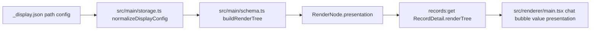

<!-- markdownlint-disable-file -->
# Task Research: Schema-Specific Field UX for Schema-Agnostic Records

Research for adding better readability-focused UX to specific semantic fields while preserving Review Assistant's schema-agnostic rendering model. The concrete motivating example is rendering request and response text like iMessage chat bubbles, even though field names may vary across schemas. The selected approach is now a project-level `_display.json` file, per user direction, rather than schema-embedded `x-presentation` metadata.

## Task Implementation Requests

* Preserve schema agnosticism while allowing better UX for specific semantic fields.
* Use the `_display.json` approach for display configuration.
* Support request/response-like fields without assuming their property names are literally `request` and `response`.
* Identify the correct implementation hook points, alternatives, risks, and tests for a future implementation.

## Scope and Success Criteria

* Scope: Renderer field presentation, schema-to-render-tree metadata flow, project configuration precedents, and tests relevant to field rendering.
* Exclusions: No application code changes in this research task, no final visual design spec, and no manual UX-only validation.
* Assumptions:
  * Schema authors can add non-standard JSON Schema metadata when needed.
  * Existing schema-agnostic behavior must remain the default for fields without presentation metadata.
  * Renderer remains UI-only; main/preload boundaries remain typed and allowlisted.
* Success Criteria:
  * A dated research file exists under `.copilot-tracking/research/2026-06-02/`.
  * Research contains evidence-linked findings with file paths and line ranges.
  * Alternatives are evaluated and one approach is selected.
  * Implementation touch points and tests are clear enough for planning.

## Outline

1. Current schema-to-rendering architecture.
2. Current field rendering hook points.
3. Project conventions and precedents for metadata/configuration.
4. Alternatives for semantic presentation selection.
5. Recommended approach and implementation outline.
6. Risks, gaps, and next research.

## Potential Next Research

* Array-level conversation presentation
  * Reasoning: Field-level bubbles improve individual values, but the `turns` array may benefit from a full conversation-thread layout.
  * Reference: `src/renderer/main.tsx:992-1010`, `.copilot-tracking/research/subagents/2026-06-02/schema-specific-field-ux-research.md`
* Display configuration editor UI
  * Reasoning: `_display.json` can be implemented as a project file first; a future UI can expose read/write flows using the same pattern as feedback configuration.
  * Reference: `src/shared/feedback.ts:80-96`, `.copilot-tracking/research/subagents/2026-06-02/display-config-ux-research.md`
* Visual design specification
  * Reasoning: Bubble widths, colors, alignment, markdown behavior, and feedback panel layout need a product/design decision.
  * Reference: `src/renderer/styles.css:528-619`

## Research Executed

### File Analysis

* `src/shared/types.ts:34-68`
  * Defines `RenderNode`, the generic rendering contract consumed by the renderer.
  * Current `value` nodes carry `label`, `path`, `description`, `value`, `type`, `enumValues`, and validation issues.
* `src/shared/types.ts:79-88`
  * Defines `RecordDetail`, which carries both opaque `schema` and renderer-consumed `renderTree`.
* `src/main/schema.ts:20-81`
  * Builds a generic `RenderNode` tree from schema plus record data.
  * Forwards `description` and `enum` metadata but no other schema hints today.
* `src/renderer/main.tsx:857-1031`
  * `RecordDetails`, `RenderTreeRoot`, and `RenderTree` render record fields recursively.
* `src/renderer/main.tsx:1023-1030`
  * Primary value rendering hook: currently chooses `EnumValue` when `enumValues` exists, otherwise renders generic `<output>`.
* `src/renderer/styles.css:528-619`
  * Existing chat message styling provides a visual precedent for user/assistant bubble treatment.
* `src/shared/feedback.ts:80-96`
  * Shows a path-keyed per-project configuration precedent for feedback settings.
* `src/shared/feedback.ts:17`
  * Defines the existing `*` wildcard convention for array item paths.
* `src/shared/feedback.ts:101-109`
  * Exports `feedbackTargetMatchesPath`, which can be reused for `_display.json` exact and wildcard path matching.
* `src/main/storage.ts:102-109`
  * Storage retrieves records and calls `buildRenderTree`; storage remains schema-neutral.
* `src/main/storage.ts:440-453`
  * `buildRecordDetail` is a private shared helper used by local and Azure record loading; threading display config through it updates both backends consistently.
* `src/preload/preload.ts:42`
  * Existing `records:get` channel can carry an additive `RenderNode.presentation` field without adding IPC.
* `src/shared/validators.ts:100-108`
  * `assertRecordDetail` performs structural checks and casts; additive optional render-tree metadata can flow through.
* `data/local-project/_schema.json:14-51`
  * Real schema includes `turns[].request` and `turns[].response`, the concrete iMessage-style candidate fields.
* `tests/unit/schema.test.ts:100-157`
  * Existing schema/render-tree unit tests are the right place to assert metadata flow.
* `tests/ui/app.test.tsx:625-682`
  * Existing renderer tests are the right place to assert presentation output.
* `docs/ARCHITECTURE.md:40`
  * Renderer owns presentation and schema-driven read-only rendering.

### Code Search Results

* Field rendering and render-tree terms investigated:
  * `RenderNode`, `RecordDetail`, `buildRenderTree`, `renderSchema`, `RenderTree`, `EnumValue`, `formatValue`, `_feedback.json`, `records:get`.
* Presentation/configuration absence:
  * No existing `_display.json`, presentation registry, or field-name heuristic layer was found by the subagent investigation.

### External Research

* None. This is a repository-architecture research task; all findings are grounded in the local codebase.

### Project Conventions

* Standards referenced: `.github/copilot-instructions.md` architecture guardrails, `docs/ARCHITECTURE.md`, existing renderer/main/preload split, storage adapter boundary, and test expectations.
* Instructions followed:
  * Keep renderer UI-only.
  * Expose renderer capabilities only through typed preload and allowlisted IPC when needed.
  * Keep storage backends behind `StorageAdapter`.
  * Add behavior-focused tests for future functional changes.
  * Keep `.copilot-tracking/**` research files markdownlint-disabled.

## Key Discoveries

### Project Structure

The app already has a clean schema-driven display pipeline:

```text
record data + JSON Schema
  -> src/main/schema.ts buildRenderTree()
  -> RecordDetail.renderTree
  -> preload records:get IPC payload
  -> src/renderer/main.tsx RenderTree
```

This means semantic presentation hints should ride on the existing render-tree contract instead of requiring the renderer to inspect raw schema or storage data. `_display.json` should be read in main/storage, normalized into a shared display config type, and applied while building the render tree.

### Implementation Patterns

Two existing patterns are directly relevant:

1. Schema metadata forwarding:
   * `src/main/schema.ts:37` forwards `description`.
   * `src/main/schema.ts:78` forwards `enum` values.
   * `src/renderer/main.tsx:1023-1030` uses forwarded metadata to change rendering.
2. Path-keyed project configuration:
   * `src/shared/feedback.ts:80-96` normalizes `_feedback.json`.
   * This is now the preferred implementation precedent for `_display.json`.
  * `src/shared/feedback.ts:17` and `src/shared/feedback.ts:101-109` already provide the `*` wildcard convention and matching helper needed by display config.

### Complete Examples

Recommended display configuration:

```json
{
  "fields": {
    "/turns/*/userUtterance": {
      "presentation": "chat-user"
    },
    "/turns/*/assistantReply": {
      "presentation": "chat-assistant"
    }
  }
}
```

The key is that names such as `userUtterance` and `assistantReply` can vary; the semantic role comes from `_display.json`, not from the property name.

Recommended type shape:

```typescript
export type FieldPresentation = 'chat-user' | 'chat-assistant';

export type DisplayConfigEntry = {
  presentation: FieldPresentation;
};

export type DisplayConfig = {
  fields: Record<string, DisplayConfigEntry>;
};

export type RenderNode =
  | { kind: 'object'; label: string; path?: string; description?: string; children: RenderNode[]; validationIssues: ValidationIssue[] }
  | { kind: 'array'; label: string; path?: string; description?: string; items: RenderNode[]; validationIssues: ValidationIssue[] }
  | { kind: 'value'; label: string; path?: string; description?: string; presentation?: FieldPresentation; value: unknown; type?: string; enumValues?: unknown[]; validationIssues: ValidationIssue[] }
  | { kind: 'raw'; label: string; path?: string; description?: string; value: unknown; reason: string; validationIssues: ValidationIssue[] };
```

Recommended renderer dispatch:

```tsx
function FieldValue({ node }: { node: Extract<RenderNode, { kind: 'value' }> }) {
  if (node.presentation === 'chat-user' || node.presentation === 'chat-assistant') {
    return (
      <output className={`field-chat-bubble field-chat-bubble--${node.presentation}`}>
        {formatValue(node.value)}
      </output>
    );
  }

  return node.enumValues ? <EnumValue node={node} /> : <output>{formatValue(node.value)}</output>;
}
```

### API and Schema Documentation

No new IPC API is needed for the selected approach. The existing `records:get` IPC response already carries `RecordDetail.renderTree`; `presentation` would be an additive optional field inside that tree.

The selected `_display.json` file should follow the feedback config pattern:

```json
{
  "fields": {
    "/turns/*/userUtterance": { "presentation": "chat-user" },
    "/turns/*/assistantReply": { "presentation": "chat-assistant" }
  }
}
```

### Configuration Examples

Initial recommended `_display.json`:

```json
{
  "fields": {
    "/turns/*/request": {
      "presentation": "chat-user"
    },
    "/turns/*/response": {
      "presentation": "chat-assistant"
    }
  }
}
```

## Technical Scenarios

### Scenario: Field-level chat bubble presentation from `_display.json`

Add an optional project-level `_display.json` file that maps JSON Pointer paths to presentation hints. Main reads and normalizes the config while loading a record, applies matching entries while building `RenderNode`, and the renderer uses the resulting hint to choose a display component.

**Requirements:**

* Preserve generic rendering for all fields without presentation metadata.
* Avoid relying on literal field names such as `request` or `response`.
* Avoid requiring schema edits; display policy should be decoupled from `_schema.json`.
* Avoid new IPC channels for the first implementation.
* Keep renderer responsible for presentation.
* Add behavior-focused tests for schema metadata flow and renderer output.

**Preferred Approach:**

* Use `_display.json` with a closed `FieldPresentation` union and path-keyed config entries.
* Rationale: This mirrors `_feedback.json`, supports schemas that cannot be edited, preserves schema agnosticism, and still requires no new IPC channel because presentation hints are baked into `RecordDetail.renderTree`.

```text
src/shared/types.ts
  add FieldPresentation, DisplayConfigEntry, DisplayConfig, and RenderNode.presentation

src/shared/display.ts
  add normalizeDisplayConfig and displayConfigEntryForPath

src/main/storage.ts
  read optional _display.json in local and Azure record loading

src/main/schema.ts
  apply display config matches while building value RenderNodes

src/renderer/main.tsx
  dispatch presented value nodes through chat-bubble output

src/renderer/styles.css
  add bubble classes, reusing existing chat message visual language

data/local-project/_display.json
  configure /turns/*/request and /turns/*/response

tests/unit/schema.test.ts
  assert display config flows to renderTree

tests/unit/display.test.ts
  assert config normalization and path matching

tests/ui/app.test.tsx
  assert chat-user/chat-assistant nodes render as bubbles
```



**Implementation Details:**

Normalize display config with an allowlist and reuse existing wildcard path matching:

```typescript
const fieldPresentationValues = ['chat-user', 'chat-assistant'] as const;
export type FieldPresentation = (typeof fieldPresentationValues)[number];

export type DisplayConfig = {
  fields: Record<string, { presentation: FieldPresentation }>;
};
```

Use `normalizeDisplayConfig()` while reading `_display.json`. Use `displayConfigEntryForPath()` in `renderSchema()` when constructing value nodes. Unknown values should not produce special presentation.

#### Considered Alternatives

* Name heuristics: rejected because they couple behavior to labels and fail when fields are named differently.
* Renderer registry: rejected because it is a more organized version of the same label coupling.
* `x-presentation`: no longer selected because the user prefers `_display.json`, and `_display.json` avoids editing generated or shared schemas.
* Hybrid heuristics plus overrides: rejected for the initial implementation because precedence rules and dual mechanisms add complexity.

## Selected Approach

Select project-level `_display.json` configuration forwarded through `RenderNode.presentation`.

This approach best satisfies the user's selected direction and the core architecture constraint: the app remains schema agnostic because it does not hard-code request/response names, and display policy remains separate from `_schema.json`. It also follows an existing repository pattern: `_feedback.json` is a project-level, path-keyed config normalized in shared code and consumed by storage/main logic.

Implementation impact:

* Add `DisplayConfig` types and one optional `presentation` field to the shared render-tree type.
* Add a shared display normalization and path lookup helper.
* Read optional `_display.json` in local and Azure record loading.
* Thread display config through `buildRecordDetail` and `buildRenderTree`.
* Add one renderer display branch or helper component.
* Add CSS for bubble presentation.
* Add sample and fixture `_display.json` files.
* Add unit, integration, and UI tests.

## Research Summary

| Item | Detail |
|---|---|
| Primary research document | `.copilot-tracking/research/2026-06-02/schema-specific-field-ux-research.md` |
| Subagent research documents | `.copilot-tracking/research/subagents/2026-06-02/schema-specific-field-ux-research.md`; `.copilot-tracking/research/subagents/2026-06-02/display-config-ux-research.md` |
| Selected approach | Project-level `_display.json` path-keyed display configuration forwarded through `RenderNode.presentation` |
| Key discoveries | 8 |
| Alternatives evaluated | 5 |
| Follow-up items | 3 |
